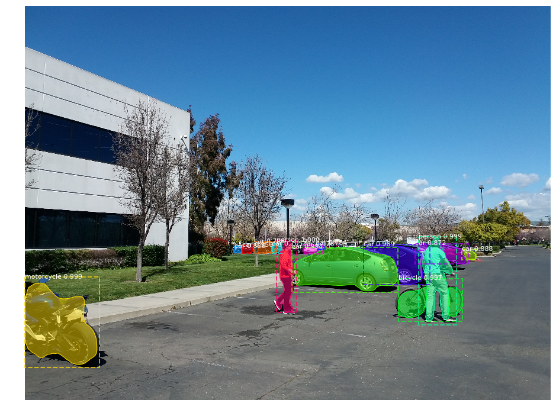
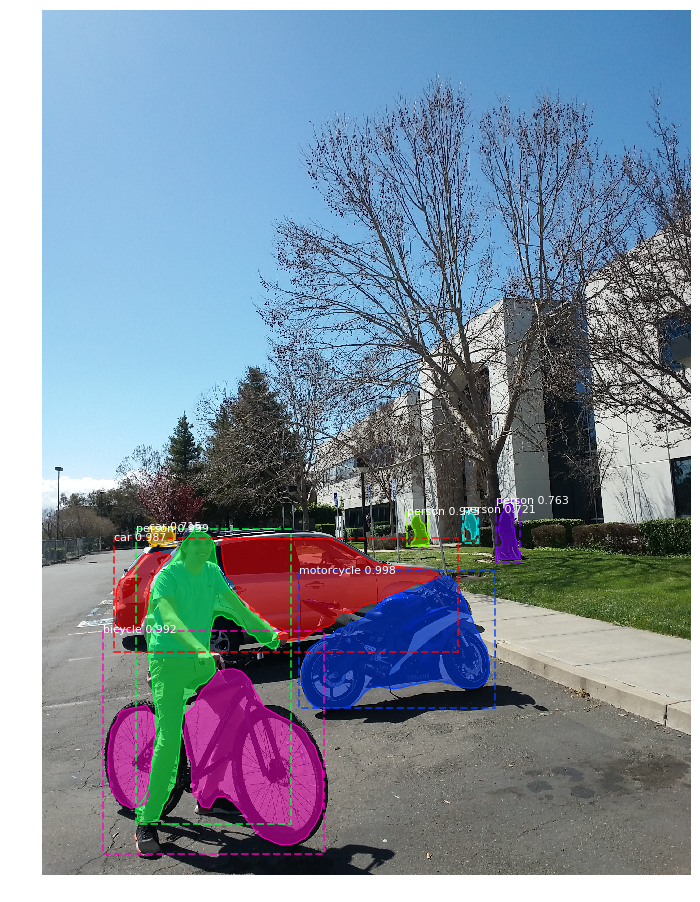
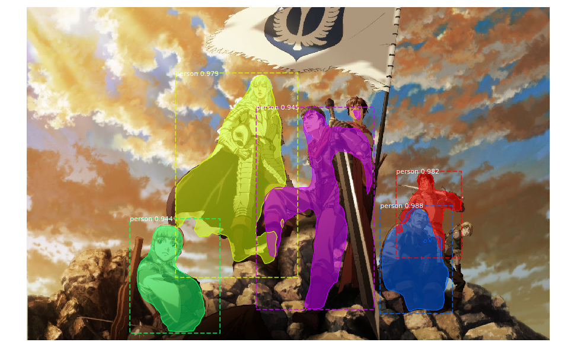

Implement RCNN model to recognize different objects, such as human, car, bike, etc.
Using github: https://github.com/matterport/Mask_RCNN/blob/master/samples/demo.ipynb

Didn't retrain the model.

Finish this project with enhsu

