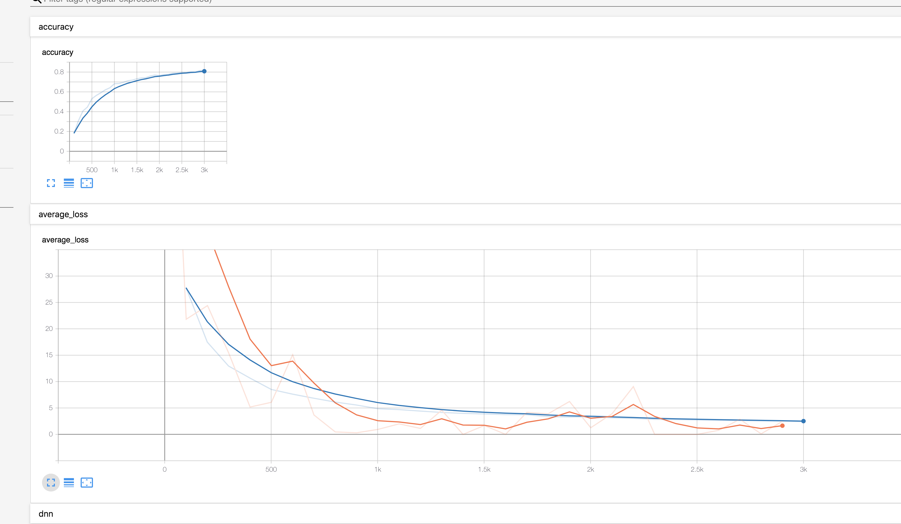
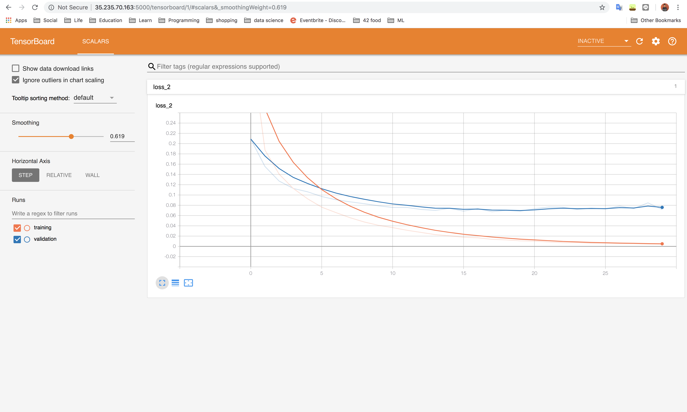
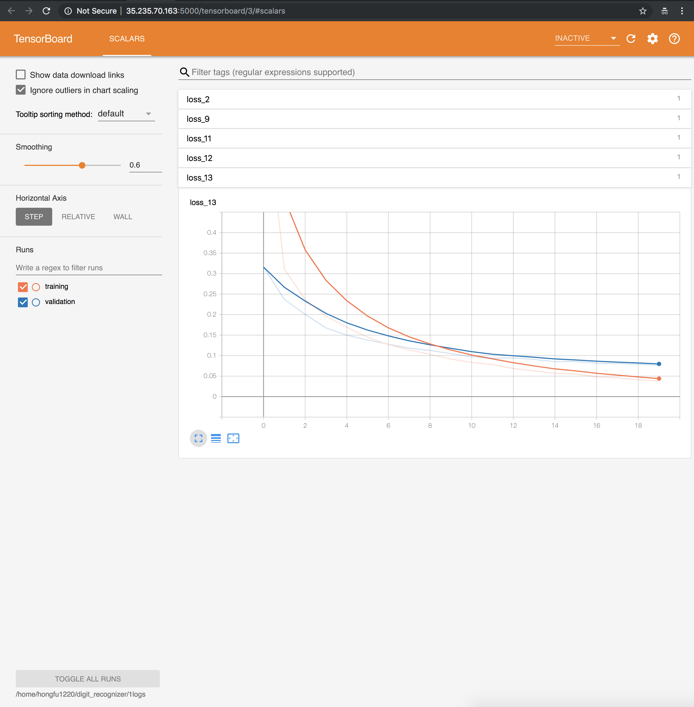

# MNIST_Dataset_Analysis
Three models built using the MNST dataset to predict digits using computer vision classification. The three models chosen are a Custom DNN using the tensorflow API,  Keras Sequential  and Keras Functional models.  

[kaggle - Digit Recognizer](https://www.kaggle.com/c/digit-recognizer/data)

## The accuracy and average loss curve using estimator

## The loss curve using Keras functional layer

## The loss curve using Keras sequential layer

