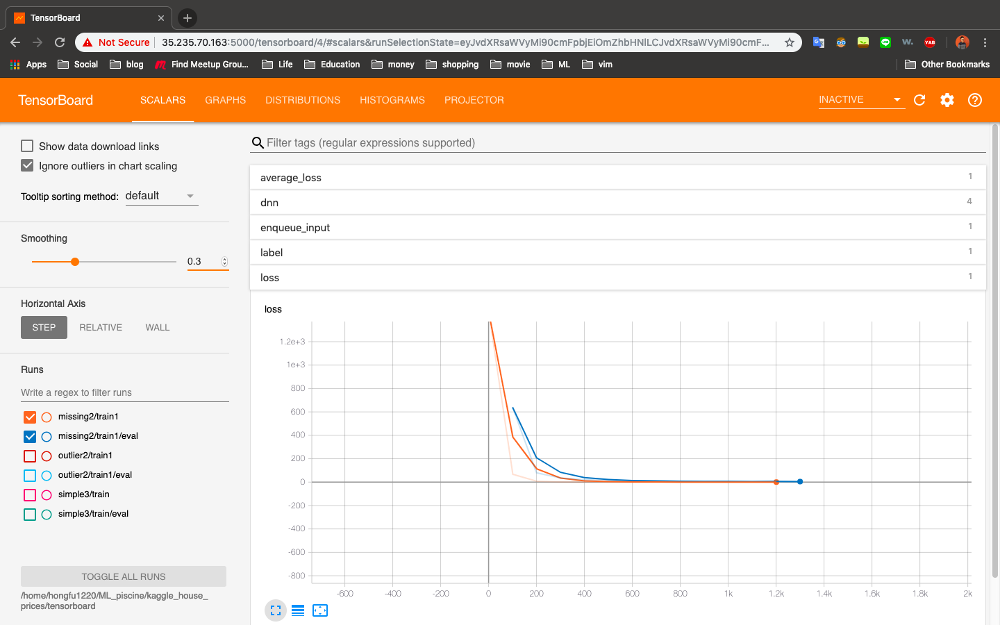

# Housing Prices: Advanced Regression

> In this project we are using linear regression to predict property sale price in dollars of houses from the input data sets containing 79 features describing almost every aspect of residential homes in Ames, Iowa

> Output file contains a list home IDs followed by the predicted sale price of the model

[kaggle - House Prices: Advanced Regression Techniques](https://www.kaggle.com/c/house-prices-advanced-regression-techniques)

## The loss curve using Tensorflow

## The loss curve using Tensorflow and feature engineering to fill the missing data and remove outlier data.

## The loss curve using Tensorflow and feature engineering to fill the missing data.

