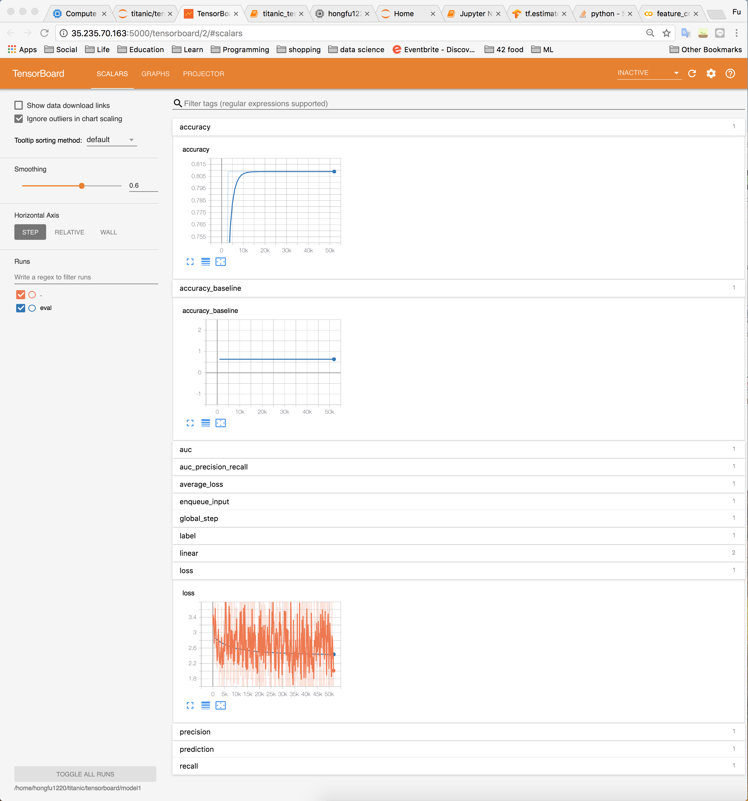
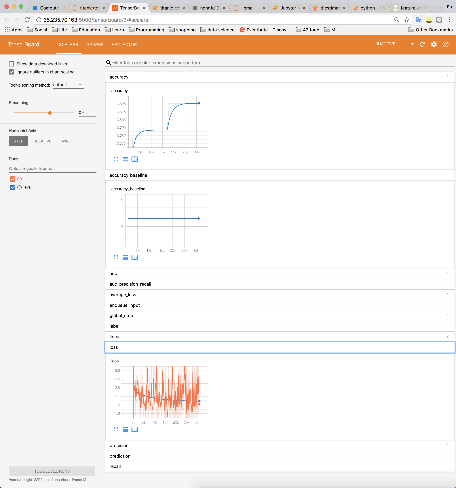

# Titanic: Machine Learning from Disaster

> In this project we are using linear regression to to predict if a passenger survived the sinking of the Titanic or not.

> Output file contains a list passenger IDs followed by the predicted survived or not of the passenager

[kaggle - Titanic: Machine Learning from Disaster](https://www.kaggle.com/c/titanic)

## The accuracy and loss curve only use gender as input data

## The loss curve using gender as input data but separate to different class

## The loss curve using gender as input data, separate to different class and bind it

